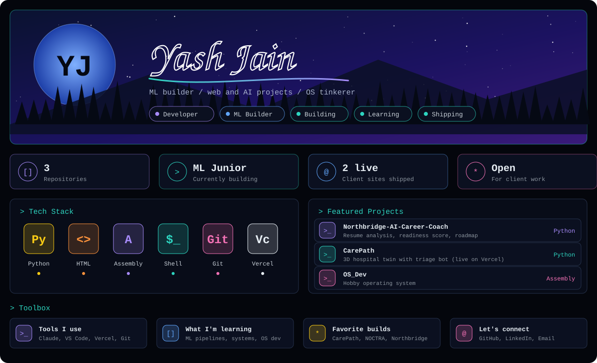

[GitHub](https://github.com/OrbitronOfficial) · [LinkedIn](https://www.linkedin.com/in/yash-jain-720621354/) · [Email](mailto:yashjainosdev@gmail.com)

## About

Building **ML Junior**, an AI assistant that automates ML workflows: preprocessing, model selection, training and explainability. I focus on lean pipelines, clean logic and practical execution, and I build websites and AI tools for clients.

## Projects

- [Northbridge AI Career Coach](https://github.com/OrbitronOfficial/Northbridge-AI-Career-Coach): evidence-grounded resume analysis, placement readiness and a roadmap to 100%
- [CarePath](https://carepath-three.vercel.app): 3D hospital twin with a triage and medicine bot
- [NOCTRA](https://noctra-demo.vercel.app): demo store built for a brand
- [OS_Dev](https://github.com/OrbitronOfficial/OS_Dev): hobby operating system in Assembly
