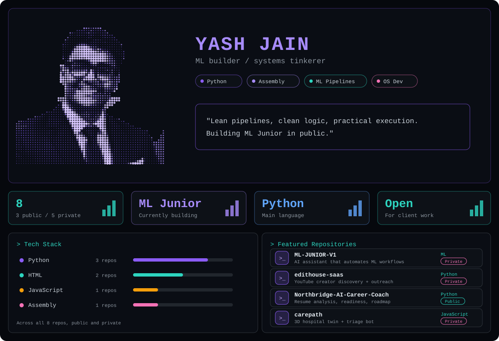

## About

I build AI tools, automation and websites. Right now that means **ML Junior** (an AI assistant that automates ML workflows), creator-outreach software for video editors, and client sites. Lean pipelines, clean logic, practical execution. Open for client work.

## Projects

**Public**

| Project | What it is |
|---|---|
| [Northbridge AI Career Coach](https://github.com/OrbitronOfficial/Northbridge-AI-Career-Coach) | Evidence-grounded platform: analyzes resumes, measures placement readiness, recommends roles and builds a roadmap to 100% |
| [OS_Dev](https://github.com/OrbitronOfficial/OS_Dev) | Hobby operating system in Assembly |

**Private (code not public)**

| Project | What it is |
|---|---|
| ML-JUNIOR-V1 | The junior ML engineer you never hired: automates preprocessing, model selection, training and explainability |
| edithouse-saas | YouTube creator discovery, enrichment and outreach platform |
| edithouse-reel-poster | Posts the EditHouse reel bot's queued Instagram reels while the laptop is off |
| [carepath](https://carepath-three.vercel.app) | 3D hospital twin with a triage and medicine bot (live demo) |
| [noctra-demo](https://noctra-demo.vercel.app) | Demo store: 3D homepage, product pages, cart and checkout (live demo) |

## Skills

- **Languages:** Python, JavaScript, HTML/CSS, Assembly, Shell
- **Build and ship:** ML pipelines, AI agents, automation bots, web apps, Python serverless, Vercel, Git

[LinkedIn](https://www.linkedin.com/in/yash-jain-720621354/) · [Email](mailto:yashjainosdev@gmail.com)

