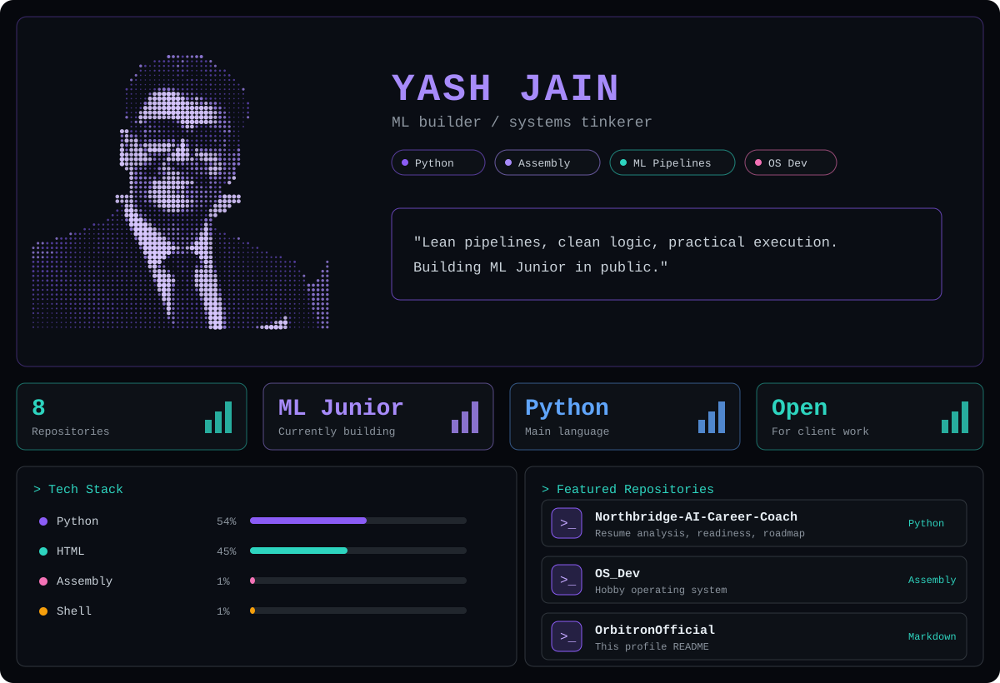

## About

Building **[ML Junior](https://github.com/OrbitronOfficial/ML-JUNIOR-V1)**, an AI assistant that automates ML workflows: preprocessing, model selection, training and explainability. I focus on lean pipelines, clean logic and practical execution.

## Skills

**Languages:** Python, JavaScript, HTML/CSS, Assembly, Shell
**Build and ship:** ML pipelines, AI agents, web apps, Python serverless, Vercel, Git
**Also:** a few more projects live in private repos (client sites, SaaS and automation work), so they don't show up on this profile.

## Now

- Building ML Junior in public
- Shipping [Northbridge AI Career Coach](https://github.com/OrbitronOfficial/Northbridge-AI-Career-Coach), an evidence-grounded resume and placement-readiness platform
- Learning low-level systems in [OS_Dev](https://github.com/OrbitronOfficial/OS_Dev)

